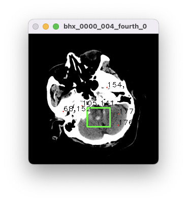

# SAM_Eval

## Introduction
Welcome to the official repository for the SAM Inference Project! This repository utilizes the pre-trained weights of SAM to provide a comprehensive platform for inference and evaluation. We are committed to building an easy-to-use and flexible SAM inference environment that meets the diverse needs of users for inference performance and results.

Both medical images and natural images can be inferred and evaluated using this repository! ! ! ! !

Our repository is based on the [SAM-Med2D](https://github.com/OpenGVLab/SAM-Med2D) &#8194; implementation, if you want to go deeper, please refer to [SAM-Med2D](https://github.com/OpenGVLab/SAM-Med2D) &#8194;!

## Updates
- (2024.07.29) Inference code of few-shot-self-prompt-SAM release
- (2024.04.26) Pre-process code of BTCV release
- (2024.04.09) Inference code of MedSAM release
- (2024.04.06) Inference code of SAM and SAM-Med2D release

## Installation
Following [Segment Anything](https://github.com/facebookresearch/segment-anything), the code requires `python>=3.8`, as well as `pytorch>=1.7` and `torchvision>=0.8`. 

For SAM_Eval, `python=3.8`, `pytorch=1.11.0`, and `torchvision=0.12.0` are used.

1. Clone the repository.
      ```
      git clone https://github.com/zzzyzh/SAM_Eval.git
      cd SAM_Eval
      ```
2. Create a virtual environment for FSP-SAM and and activate the environment.
    ```
    conda create -n sam_eval python=3.8
    conda activate sam_eval
    ```
3. Install Pytorch and TorchVision. 
    ```
    conda install pytorch==1.11.0 torchvision==0.12.0 torchaudio==0.11.0 cudatoolkit=10.2 -c pytorch
    ```
    or
    ```
    conda install pytorch==2.1.0 torchvision==0.16.0 torchaudio==2.1.0 pytorch-cuda=11.8 -c pytorch -c nvidia
    ```
4. Install other dependencies.
    ```
    pip install -r requirements.txt
    ```

## Contribution
Our project primarily evaluates the segmentation effects of different prompting methods. Users can set the strategy parameter to explore how various strategies impact the segmentation outcomes.

- point
    - base: Identify areas of incorrect prediction and randomly select points from these mispredicted areas.
    - far: Identify areas of incorrect prediction and choose the point furthest from the boundary within these mispredicted areas.
    - m_area: Identify areas of incorrect prediction, divide them into false positive and false negative areas, and choose a point furthest from the boundary in the area with the larger surface area.
- box
    - base: The bounding rectangle of the mask.
    - square_max: Construct a square using the longer side of the mask's bounding rectangle, with the center coinciding with the mask's centroid.
    - square_min: Construct a square using the shorter side of the mask's bounding rectangle, with the center coinciding with the mask's centroid.

## Data Preparation

### Download
1. **Abdominal CT**  [Synapse Multi-atlas Abdominal Segmentation dataset](https://www.synapse.org/#!Synapse:syn3193805/wiki/217789)

### Pre-processing
Please refer to [Cheng et al.](https://arxiv.org/abs/2308.16184)

Our data follows the data preprocessing process mentioned in the [SAM-Med2D](https://github.com/OpenGVLab/SAM-Med2D) &#8194; paper. You can refer to `data/SABS/sabs.py` to process your own dataset.

## Test
- point
    ```
    python test.py --sam_mode sam --task abdomen --dataset sabs_sammed --model_type vit_b --sam_checkpoint ../sam_vit_b_01ec64.pth --image_size 1024 --prompt point --strategy base --iter_point 1
    ```
- box
    ```
    python test.py --sam_mode sam_med2d --task abdomen --dataset sabs_sammed --model_type vit_b --sam_checkpoint ../sam-med2d_b.pth --prompt box --strategy base
    ```

## Generate a prompt list for the dataset locally
Considering that most existing evaluation methods require prompts to be generated based on masks, for images without masks, the only way to utilize SAM to produce segmentation results is by manually selecting points and boxes on the image, recording their coordinates, and then submitting them to SAM to generate the segmentation outcome. For this reason, I have written a script that can generate a prompt list for a set of images locally in advance. Everyone can download `find_prompt_gui.py` to use locally.
- It features two modes (point and box), which can be switched by clicking `m`.
    - In point mode, clicking any location on the image will display the coordinates of that point on the image and record these coordinates.
    - In box mode, drawing a box around any object on the image will display the corresponding box and record the coordinates of the box's top-left and bottom-right corners.
- A `.json` file will be generated for each group of images, recording the coordinates of the prompts for each image.
- Clicking `q` will change the image.
- Clicking `esc` will exit the program.
- Due to certain reasons, after you run the program, you need to click `m` once to enter the box mode at first.
- example:
<p align="center"></p> 

## Citation
```bash
@misc{SAM_Eval_2023,
  author = {Yan, Zhonghao},
  title = {{SAM Evaluation}},
  year = {2024},
  howpublished = {\url{https://github.com/zzzyzh/SAM_Eval}},
}
```

## Acknowledgement
Thanks to the open-source of the following projects
- [Segment Anything](https://github.com/facebookresearch/segment-anything) &#8194; 
- [SAM-Med2D](https://github.com/OpenGVLab/SAM-Med2D) &#8194;

## Contact Us
If you have any suggestions for the project, or would like to discuss further expansions with us, please contact us at the following email: zzzyzh@qq.com or zzzyzh@bupt.edu.cn. We look forward to your valuable input!